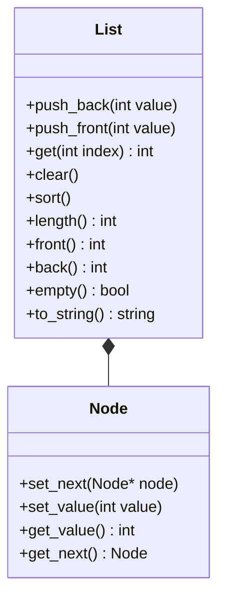

# Lab2
TDDC76 Lab2 - Enkel länkad lista

Egen implementation av en enkel länkad lista i enlighet med de specifikationer och krav givna i uppgiften. 
Uppgift -> se single_list.pdf.

```mermaid
classDiagram
    class List {
        +push_back(int value)
        +push_front(int value)
        +get(int index) int
        +clear()
        +sort()
        +length() int
        +front() int
        +back() int
        +empty() bool
        +to_string() string
    }
    class Node {
        +set_next(Node* node)
        +set_value(int value)
        +get_value() int
        +get_next() Node
    }
    List *-- Node
```
